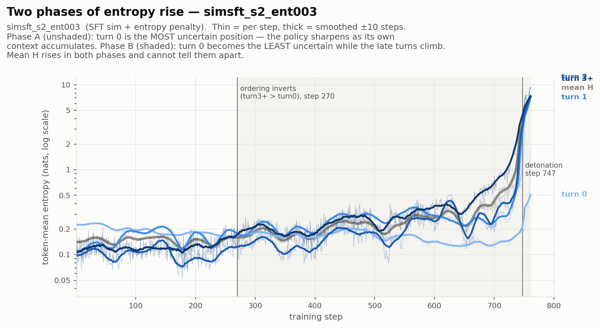
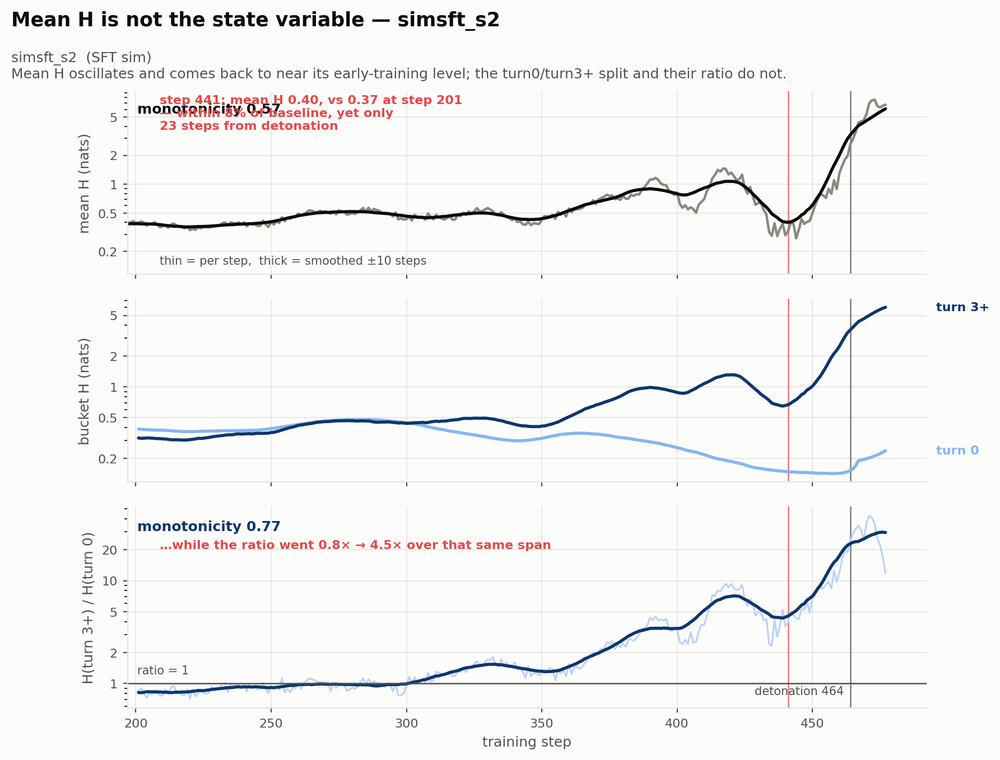
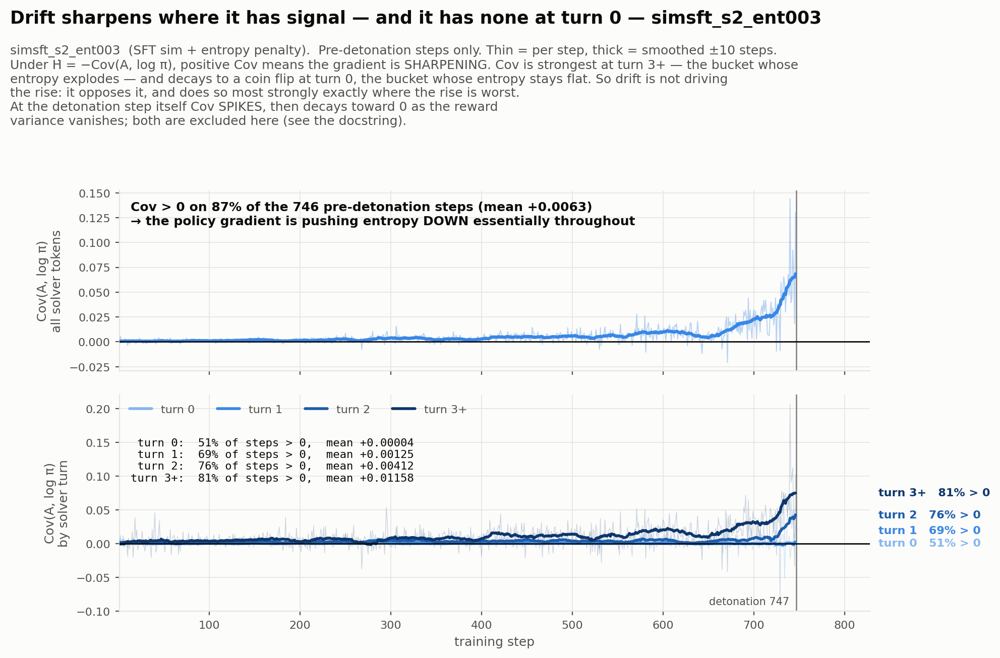
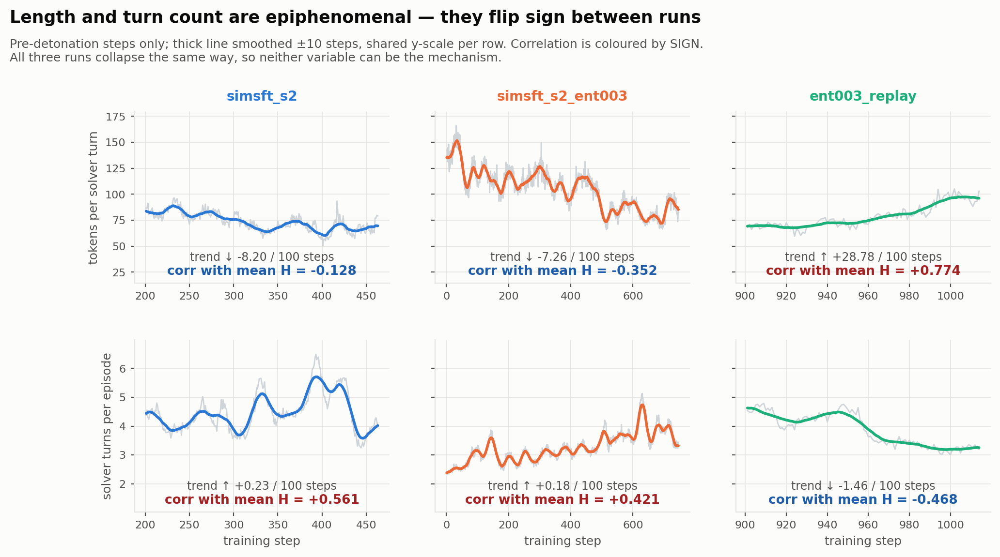
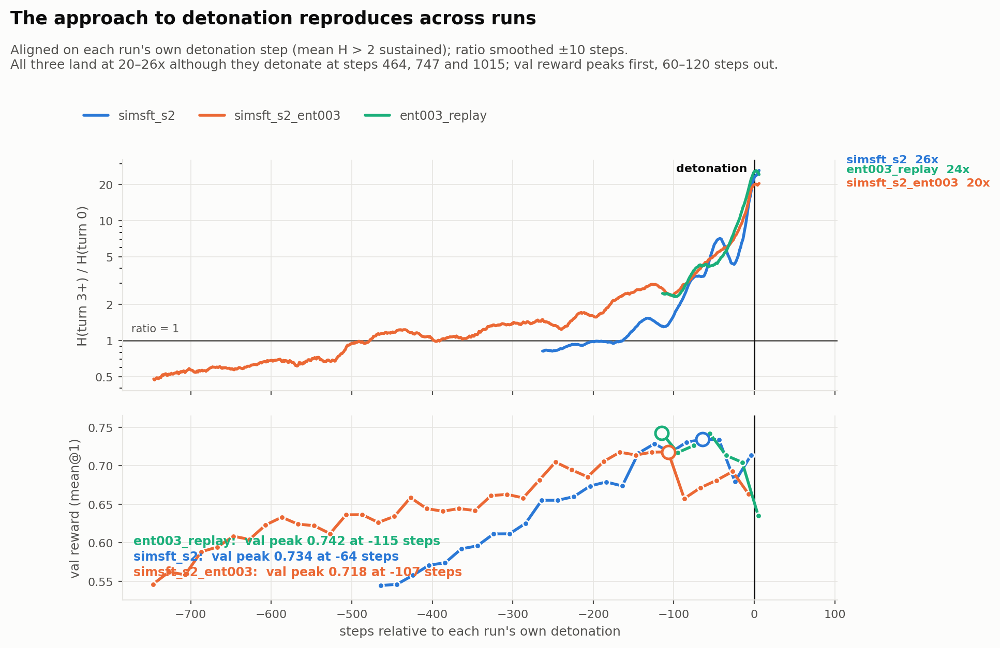

# ColBench entropy collapse: what the turn-bucket diagnostics show

**Status: the mechanism is now localised, and one leading hypothesis is dead.**
Entropy collapse is **not one process**. There is a benign entropy rise and a
pathological one, they are indistinguishable in `actor/entropy`, and that is why
every knob aimed at mean H has failed. The pathological one is
**position-conditional**: the policy sharpens on the fixed problem statement
while losing calibration on its own generated context.

Two claims settle it, and the figures are scoped to those two. **The rise comes
from the late turns** (§2, §3) and **the policy gradient is not what drives it
up** (§4) — drift opposes the rise throughout, and most strongly in the very
bucket that runs away. §5 separately rules out the reading that the explosion is
just episodes gaining turns. Everything else we tried to show was either
underpowered or failed to replicate, and has been deleted rather than hedged
(§10).

Dates: metrics wired 2026-09-16, analysed 2026-09-18, refreshed 2026-09-18
when the third run detonated.
Related: [`../simtrain/RESULTS.md`](../simtrain/RESULTS.md) (the SFT'ed sim used
by two of these runs).

**Priority update (2026-09-18):** first establish collapse under a larger (235B)
training simulator and the entropy-coefficient learning tradeoff. See
[`PRIORITIES.md`](PRIORITIES.md) for the existing-run comparison and proposed
experiment. Covariance repair, rollout mismatch, and long-conversation
concentration are deferred; this supersedes the ordering in §9.

---

## 1. What is instrumented, and on which runs

The diagnostics live in `verl/trainer/ppo/ray_trainer.py` (the functions) and are
called from **`verl/trainer/ppo/v1/trainer_base.py`** — the V1 sync trainer is
what colbench actually runs, and wiring them only into the V0 `RayPPOTrainer`
cost a 5-hour replay that emitted nothing. `colbench/tests/test_turn_bucketed_entropy.py`
has wiring tests that pin this; no amount of maths testing catches it.

| metric | what it is |
|---|---|
| `actor/entropy_turn0…3plus` | token-mean entropy, bucketed by **solver turn index** (run-length decode of `response_mask`) |
| `actor/entropy_turn*/tok_frac` | share of masked tokens in each bucket |
| `actor/entropy_turns/mean` | solver turns per episode, train side |
| `actor/solver_turn_len/mean` | tokens per solver turn, train side |
| `actor/adv_logp_cov` (+ per bucket) | `Cov(A, log pi)` over masked tokens, **raw sign, not negated** |

`Cov` is a *token*-level covariance, but because the GRPO advantage is one
scalar per episode broadcast across that episode's masked tokens, it collapses
algebraically to the **length-weighted episode-level** covariance
`Cov_w(A_i, m_i)` with `m_i` = that episode's mean per-token logprob and
`w_i = len_i / sum(len)`. Two consequences worth knowing before reading §4:
masked length spans ~110–3100 tokens in a single batch, so the weighting is not
a rounding detail; and with *equal* weights the within-group centering of GRPO
advantages (`sum_{i in g} A_i = 0`) would cancel all cross-task variation
exactly, making the statistic purely within-task — length weighting breaks that
cancellation. **Trust the sign, not the magnitude.**

Under replicator dynamics `H_dot = -Cov(A, log pi)`, so **Cov > 0 means the
policy gradient is pushing entropy DOWN**.

| run | steps | buckets from | outcome |
|---|---|---|---|
| `spec_simsft_s2` | 0–477 | 201 | detonates 464; val peak 0.734 @ 400 |
| `spec_simsft_s2_ent003` | 0–761 | **1** | detonates 747; val peak 0.718 @ 640 |
| `spec_ent003_replay900_diag2` | 900–1049 | 901 | detonates 1015; val peak 0.742 @ 900 |

"Detonation" throughout = first step where mean H > 2 nats and stays above.
Reproduce the series with `python3 parse_runs.py`, the figures with `figures.py`
(inside the container — the login node has no matplotlib).

---

### The figure set

Five figures, 11 PNGs. The sections below inline one representative run each;
the per-run variants are all in `figures/` and are worth checking, because two
earlier "findings" died precisely by not replicating across runs.

| figure | per run? | what it argues |
|---|---|---|
| `f1_two_phases_<run>` | yes (3) | the benign vs position-divergent phases; mean H rises in both |
| `f2_mean_h_lies_<run>` | yes (3) | mean H returns to near-baseline while turn0/turn3+ and their ratio do not |
| `f3_drift_sign_<run>` | yes (3) | `Cov` over time, overall and per turn — drift sharpens, and orders *with* the divergence |
| `f4_time_to_detonation` | cross-run | all three runs land at ratio 20–26× however long they take |
| `f6_length_epiphenomenal` | cross-run | length and turn count flip sign across runs, so neither is the mechanism |

There is no `f5`: a cascade figure was built and deleted (§10).

## 2. The headline: two phases, and mean H cannot tell them apart

- **Phase A** — mean H rises with the position ordering **healthy**: turn 0 is the
  *most* uncertain position, and the policy sharpens as its own context
  accumulates. Reward improving. This rise is benign.
- **Phase B** — the ordering **inverts**: turn 0 becomes the *least* uncertain
  while late turns climb. On `simsft_s2`, `entropy_turn0` falls 0.499 → 0.129
  (t = **−25.2**) while `entropy_turn3plus` rises (t = **+15.7**), and
  corr(turn0, turn3plus) = **−0.627** — the buckets move in *opposite* directions.

Position spread on `simsft_s2`, window means:

| window | turn0 | turn1 | turn2 | turn3+ | t3+/t0 |
|---|---|---|---|---|---|
| 210–250 | 0.370 | 0.500 | 0.357 | 0.326 | **0.88** |
| 250–300 | 0.457 | 0.646 | 0.515 | 0.439 | **0.96** |
| 300–350 | 0.347 | 0.580 | 0.479 | 0.457 | 1.32 |
| 350–400 | 0.324 | 0.680 | 0.798 | 0.750 | 2.32 |
| 400–440 | 0.190 | 0.434 | 0.645 | 0.984 | 5.17 |
| 440–462 | 0.145 | 0.351 | 0.355 | 1.069 | **7.40** |

Caveat: the *full* ordering is not monotone in turn index in every run —
`simsft_s2_ent003` starts with turn1/turn2 below turn3+. The robust claim is
about **turn 0's rank**: it starts highest and ends lowest.

---

## 3. `turn3+/turn0` is the state variable; mean H is not

Monotonicity index `|sum d| / sum|d|` (1.0 = perfectly monotone, ~0 = noise),
on the smoothed series over each run's bucketed pre-detonation window. It is
**stride-free on purpose** — counting "reversals" needs a sampling stride, and
the count then depends on the stride you picked:

| run | mean H | **ratio** |
|---|---|---|
| `simsft_s2` | 0.57 | **0.77** |
| `simsft_s2_ent003` | 0.77 | 0.77 |
| `ent003_replay` | 0.89 | **0.95** |

⚠️ **This statistic is window-sensitive and is the weakest evidence here.** The
ratio wins in two runs and ties in the third. When `simsft_s2_ent003` was
truncated at step 671 (pre-ramp) it read 0.13 vs 0.31 — a large gap — but
including its detonation ramp gives mean H a strong trend too and the gap
closes. Do not lead with it; the load-bearing evidence is the cross-run landing
point in §6, the lead times, and the case below.

The decisive case is `simsft_s2` at
**step 441**: mean H has fallen back to **0.40 vs 0.37** at step 201 — within 8%
of baseline, looking recovered — **23 steps before detonation**. Over that same
span the ratio went **0.8x → 4.5x** and never came back.

> ⚠️ An earlier version of this claim said mean H at step 440 was *below* its
> step-220 value. That compared two individual noisy steps and **does not survive
> smoothing** — the smoothed dip lands slightly *above* the early level. The
> claim is "returns to near-baseline", never "below baseline".

**Plot the numerator and denominator, not just the ratio.** The ratio rises via
turn0 *falling* (`simsft_s2`) or turn3+ *climbing* (`simsft_s2_ent003`). Same
state variable, different mechanism.

---

## 4. Drift has the wrong sign to be the source (H2)

`adv_logp_cov` is **positive on 87–94% of pre-detonation steps** in all three
runs. Under `H_dot = -Cov`, that means the policy gradient is pushing entropy
**down** the whole time H rises. **Drift cannot be the source.**

Note the aggregate is carried by the late turns: at turns 0–1 Cov is a coin
flip with a mean near zero, so "positive at every turn" would be wrong — the
claim is about the *ordering*, below.

The per-turn breakdown is the sharper result — drift's signal **orders by turn
position, in the same direction as the entropy divergence**:

| | overall | turn 0 | turn 1 | turn 2 | turn 3+ |
|---|---|---|---|---|---|
| `simsft_s2` | 94% | **56%** | 52% | 64% | **92%** |
| `simsft_s2_ent003` | 87% | **51%** | 69% | 76% | **81%** |
| `ent003_replay` | 92% | **53%** | 57% | 82% | **95%** |
| mean Cov (replay) | +0.0272 | **+0.00008** | +0.0040 | +0.0213 | **+0.0486** |

Turn 0 is a **coin flip** with a mean Cov ~100–600× smaller than turn 3+: the
gradient has essentially no entropy-directional signal there, and turn 0's
entropy is the bucket that stays flat or falls. Turn 3+ carries the strongest
sharpening pressure of any bucket and is the bucket whose entropy goes 8×. A
drift-driven story predicts the opposite ordering, so this is the cleanest
statement of the refutation: **drift opposes the rise most strongly exactly
where the rise is worst.**

(Because the advantage is an episode outcome broadcast to tokens, a bucket asks
"does confidence at that turn predict how the whole episode scores?" — so
turn 0's null is itself sensible: an opening turn's confidence says little about
the outcome.)

### What we removed, and why

An earlier F3 scattered `dH = H[t+1] - H[t]` against `Cov` to test whether drift
*quantitatively* accounts for the rise. **That plot had no power and has been
deleted.** `H[t+1]` is measured on a fresh draw of 120 tasks × 4 samples, so its
step-to-step noise is ~±0.05 while the mean `dH` it was meant to explain is
~+0.006 — an order of magnitude the wrong way. The flat cloud it produced was
not evidence of no relationship, and the within-block sign counts it reported
(2/7, 16/17, 3/4) were that lack of power showing up as run-to-run randomness.
Its H2-prediction line also had an arbitrary slope, inviting a magnitude claim
nobody made.

To actually measure the drift coefficient you must first kill that noise:
aggregate `Cov` and `dH` over ~10-step blocks, or hold the prompt set fixed
across consecutive steps. Neither is instrumented.

### A known defect in the metric itself

The derivation (`dH ≈ -eta * A * p_a * (log p_a + H)`, from
`dH/dz_k = -p_k(log p_k + H)` and a ratio that is identically 1 at
`ppo_epochs=1`) wants each token's logprob centered by **its own context's**
entropy. The implementation centers by the **pooled** `E[log pi]` over the whole
batch, and drops the `p_a` weight. A high-entropy context therefore has all its
tokens labelled "unlikely" when some were its mode. The corrected statistic is
the masked mean of `A_it * (logpi_it + H_it)` — no new forward pass, since
`data.batch["entropy"]` already holds per-token H; the only plumbing is adding
`"entropy"` to the field list at `v1/trainer_base.py:1341`. **Not yet done.**

## 5. Length and turn count are epiphenomenal

Both channels **flip sign across runs that collapse identically**:

| | `simsft_s2` | `simsft_s2_ent003` | `ent003_replay` |
|---|---|---|---|
| `solver_turn_len` trend | ↓ −8.20 /100 | ↓ −7.26 /100 | **↑ +28.78 /100** |
| corr(turn_len, H) | −0.128 | −0.352 | **+0.774** |
| `num_turns` trend | ↑ +0.23 /100 | ↑ +0.18 /100 | **↓ −1.46 /100** |
| corr(num_turns, H) | **+0.561** | **+0.421** | −0.468 |

`ent003_replay` is the odd one out on *both*. This **retracts** a per-turn-length
"finding" derived from that run alone. It also kills the turn-composition
hypothesis more cleanly than any single run could: the mix does not merely move
the wrong way, it moves in *opposite* directions.

---

## 6. The approach to detonation reproduces

All values smoothed ±10 steps, exactly as plotted:

| t − D | `simsft_s2` ratio | `ent003_replay` ratio | s2 mean H | replay mean H |
|---|---|---|---|---|
| −100 | 1.63 | 2.39 | 0.584 | 0.286 |
| −60 | 3.77 | 4.33 | 0.780 | 0.349 |
| −20 | 5.11 | 9.78 | 0.430 | 0.692 |
| **0** | **22.9** | **25.8** | 3.262 | 3.106 |

The ratio lands in the same place. Mean H cannot align them — and note
"mean H at detonation" is **circular**, since detonation is *defined* as
`H > 2`. The ratio landing at 20–26× is not: nothing about the ratio enters
that definition.

Lead time from the ratio crossing 1.0 to detonation is **not** a constant:

| run | inversion | detonation | lead |
|---|---|---|---|
| `simsft_s2` | 301 | 464 | 163 |
| `simsft_s2_ent003` | 270 | 747 | **477** |
| `ent003_replay` | 901 | 1015 | ≥114 (already inverted at its first bucketed step) |

So the entropy penalty stretched the inverted phase ~3× without changing where
it ends up. Reward turns over **first**:
val peak → detonation is **64 steps** (s2) and **115** (replay), with
`group_reward_std` ~0.16 and `zero_frac` ~0.50 flat throughout — so signal
exhaustion is a **precursor**, and the reward ceiling is the same (0.734 / 0.742)
whether it takes 400 steps or 900.

---

## 7. The prospective test, resolved

`spec_simsft_s2_ent003` (job 46946121) was the cross of both interventions:
SFT'ed sim + `ENTROPY_COEFF=-0.003`. On 2026-09-18, with the run at step 671 and
the ratio at 3.2×, §7 recorded this prediction **before the fact**:

> Mean H and val keep looking fine until the ratio passes ~5–8, and detonation
> follows within ~60–100 steps.

**It detonated at step 747.** Scoring it honestly:

| | outcome |
|---|---|
| mean H gives no warning | ✅ stayed ≤0.6 while the ratio climbed 2.5 → 6.8 |
| val gives no warning | ✅ 0.66–0.69 through ratio 5–7 (peak 0.718 @ 640) |
| ratio lands where the others did | ✅ **20.0×** vs 22.9 and 25.8 |
| val peak leads detonation | ✅ **107 steps**, vs 64 and 115 |
| detonation 60–100 steps after ratio 5–8 | ❌ **20–47 steps** — too slow by ~2× |

| step | mean H | ratio | Cov | trainR | val |
|---|---|---|---|---|---|
| 640 | 0.257 | 2.47 | +0.001 | 0.642 | **0.718** ← peak |
| 700 | 0.429 | 5.31 | +0.032 | 0.741 | 0.681 |
| 720 | 0.592 | 6.82 | +0.027 | 0.647 | 0.693 |
| 740 | 1.629 | 14.88 | +0.144 | 0.641 | 0.663 |
| **747** | | | | | **detonation** |
| 760 | 7.096 | 21.19 | +0.00000 | 0.000 | 0.001 |

So the *structure* replicated and the *timing* was wrong in the conservative
direction: once the ratio is past ~5 there is less runway than I estimated.
Anyone using the ratio as a trigger should assume **tens of steps, not
~100**.

What the entropy penalty bought: the inverted phase stretched from 163 steps
(`simsft_s2`) to **477**, and detonation moved 464 → 747. What it did not buy:
any change in where the ratio ends up, or any warning from mean H — which held
0.10–0.39 for 700 steps and then went to 7.1 in thirteen.

## 8. Where this leaves the hypotheses

| # | hypothesis | verdict |
|---|---|---|
| H1 | turn composition (H rises only because episodes gain turns) | **REJECTED** — mix moves in opposite directions across runs (§5); `entropy_turn0` never drives it |
| H2 | negative-covariance drift pumps H | **REJECTED as the source** — Cov > 0 on 87–94% of steps, and its per-turn strength orders *with* the divergence rather than against it (§4). Whether drift tracks the formula quantitatively is untestable at this noise level |
| H3 | diffusion / optimizer noise | **half-accepted** — dH is unexplained by drift, and `actor/lr` is a constant 1e-6. But plain diffusion is position-blind and this is not: turn 0 flat-to-falling while turn3+ goes 8x. The residual is real and **structured** |
| H4 | signal exhaustion | **precursor, not cause** — reward turns over 45–115 steps before detonation, every run |
| H5 | entropy penalty loses authority at uniform | consistent with the absorbing state: `Cov` → exactly 0, `zero_frac` → 1.00, H peaks 10.96 of 11.93 nats then decays under the regulariser alone |

**Settled earlier, not relitigated here:** total-length runaway (rejected);
zero-variance groups (rejected — n=16 halved `zero_frac` and collapse came 2.2x
earlier); `clip_ratio`/DAPO clip-higher (**structurally inert** — `ppo_epochs=1`
with mini == train batch makes the ratio identically 1, so `pg_clipfrac` is
always 0); sim failure as the variance driver (~2% of episodes).

---

## 9. What follows

1. **`t3+/t0` is an early-warning signal, but pick the threshold carefully.**
   Lead from the ratio crossing 1.0 to detonation is **163 / 477 / ≥114** steps
   — useful but not a constant, so "crossed 1.0" is a *watch* condition, not an
   act-now one. Crossing **~5** is the act-now condition, and §7 measured only
   **20–47 steps** of runway past it. All from metrics already logged. Worth a stopping rule or
   an LR drop on that crossing rather than on mean H.
2. **Position-weighted entropy regularisation.** The penalty is a uniform scalar,
   but turn 0 sits at 0.13–0.15 and is *sharpening*. Uniform pressure spends its
   budget where there is no problem. `entropy_turnN` now measures whether a
   weighted version worked.
3. **Rule out the boring story first.** Everything above says the divergence is
   a function of *position in the episode*: it is absent at turn 0, whose context
   is only the problem statement, and worst at turn 3+, conditioned on hundreds
   of the model's own tokens. That is also exactly the signature of **long-context
   rollout mismatch** between the SGLang sampler and the FSDP actor — far more
   mundane, and far more fixable, than anything in the table above. The test is
   `rollout_corr/kl` bucketed by turn index, reusing the run-length decode
   `compute_turn_bucketed_entropy` already does. **Not yet instrumented — this is
   the agreed next step.**

   (An earlier version of this argument leaned on the divergence *propagating*
   backwards turn-by-turn. That propagation held in one run of three and has been
   retracted — see §10. The position dependence it rests on now is in all three.)

## 10. Gotchas that cost real time

- **Metrics wired to the wrong trainer.** `actor/entropy` is computed in *both*
  `ray_trainer.py` and `v1/trainer_base.py`, so verifying against the V0 file is
  true and uninformative. Only V1 runs. Cost: one 5-hour replay.
- **Prefix-glob collision in log names.** `cb_spec_simsft_s2_*.out` also matches
  `spec_simsft_s2_ent003` and silently spliced 672 steps of a different
  experiment over 478 of this one. `parse_runs.py` matches the exact
  `cb_<exp_name>_<jobid>.out`.
- **Chained-job overlaps are a re-roll, not a continuation.** A `--chain` resume
  restarts from the last checkpoint, so the overlapping steps are a fresh rollout
  on a different RNG stream (H 0.310 vs 0.332 at step 220). The later job must
  win, or two trajectories get spliced.
- **A step's metrics arrive on several log lines** (`val-core/*` is separate and
  only every `test_freq`), so per-step dicts must be **merged**, not replaced.
- **`SAVE_FREQ=25` on a replay** writes 47 GB every 25 steps and will kill the
  job. A replay's checkpoints are worthless: use `SAVE_FREQ=-1`.
- **A single-run pattern is not a mechanism — this bit us twice.** Two claims
  derived from one run and presented as structure both failed to replicate: the
  per-turn-length correlation (§5) and a "cascade" in which the divergence
  propagates late→early. The cascade's clean wavefront (turn3+ 981, turn2 999,
  turn1 1007, turn0 1026) holds in `ent003_replay` **only**. In `simsft_s2`
  turn 0 never doubles at all — it *falls* — and turn 1 crosses only after
  detonation; in `simsft_s2_ent003` turns 1 and 2 cross in the wrong order (422
  vs 553). Its figure has been deleted. Check a pattern in all three runs before
  writing it down as a finding.
- **Raw single-step comparisons lie.** The step-440-vs-220 claim in §3 evaporated
  under smoothing. Compare smoothed series, or don't compare.
