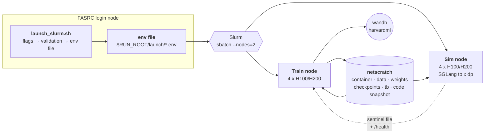

# Experiment Infrastructure (SLURM / FASRC)

This folder launches experiments from an **FASRC login node** onto **Slurm**, which
allocates compute on the Kempner cluster. There is one launcher
([launch_slurm.sh](launch_slurm.sh)) and one entrypoint per stack. A run is specified by
launch flags, and every artifact it produces stays on the **shared filesystem** — there is
no object store to sync to.

It replaces [xcloud_setup/](../xcloud_setup/), which is kept untouched as the reference for
*experimental* reasoning: every comment about why an arm is shaped the way it is still
lives there, and the files here point back at it rather than restating it.

- [1. Launch Slurm experiments from a login node](#1-launch-slurm-experiments-from-a-login-node)
- [2. Inside the nodes](#2-inside-the-nodes)
- [3. What the entrypoint does](#3-what-the-entrypoint-does)
- [4. Experiment identity and storage layout](#4-experiment-identity-and-storage-layout)
- [5. Running experiments](#5-running-experiments)
- [6. Logging: wandb](#6-logging-wandb)
- [7. What changed from xcloud, and why](#7-what-changed-from-xcloud-and-why)
- [8. Gotchas that cost a round trip each](#8-gotchas-that-cost-a-round-trip-each)
- [9. File map](#9-file-map)

## 1. Launch Slurm experiments from a login node

`launch_slurm.sh` validates the flags, resolves the stable experiment identity, writes the
entire run configuration to an `--env-file`, and `sbatch`es
[train_colbench.sbatch](train_colbench.sbatch). Slurm allocates **two nodes in one job**:
node 0 trains, node 1 serves the frozen user simulator. Both run the same container from
the same code snapshot; the per-run env decides which role each plays.



### 1a. What a launch actually selects

Two flags pick the stack; everything else is a knob on top of that choice. There is no
`--dockerfile_path` — one container serves every stack, and the entrypoint is chosen by
`ENTRYPOINT` (defaulted per sbatch script) rather than baked into an image.

| Flag | What it decides |
| --- | --- |
| `--train_script` | Which training loop runs. The entrypoint also *reads* this name: a `*spec*` script switches ColBench to the spec dataset. |
| `--model` | The solver, and (unless `--sim_model` is given) the frozen base the simulator serves. Drives thinking, rollout memory fraction and the FSDP profile via the registry in [paths.sh](paths.sh). |
| `--sim_remote` / `--sim_live` | The simulator regime, which also sets the **node count**. |

| Stack | Entrypoint | Training scripts |
| --- | --- | --- |
| ColBench (GT code) | [entrypoint_colbench_slurm.sh](entrypoint_colbench_slurm.sh) | [run_colbench_grpo.sh](../colbench/run_colbench_grpo.sh) |
| ColBench (spec) | same | [run_colbench_grpo_spec.sh](../colbench/run_colbench_grpo_spec.sh) |
| ColBench spec eval | [entrypoint_eval_colbench_slurm.sh](entrypoint_eval_colbench_slurm.sh) | [run_validate_colbench_spec.sh](../colbench/run_validate_colbench_spec.sh) |
| CodeContests | *not ported* | — |

The launcher validates the combination **on the login node**, in milliseconds, before
anything is submitted: flag coherence (ported from `launch.py`), plus two checks it could
not do — are the model weights actually staged on this cluster, and does the requested
dataset/`--spec_author` parquet exist.

## 2. Inside the nodes

### 2a. The default: external simulator, two nodes

`--sim_remote` is the **default** here, where it was the exception on xcloud, because a
Kempner node has **4** GPUs, not 8:

| | 8 GPUs (xcloud) | 4 GPUs (Kempner) |
| --- | --- | --- |
| co-hosted, `SIM_TP=1` | train 6, idle 1 | train **2**, idle 1 |
| co-hosted, `SIM_TP=2` | train 6, idle 0 | train **2**, idle 0 |
| co-hosted, `SIM_TP=4` | train 4, idle 0 | **fails** |
| external sim | train 8 | train **4** + a 4x-DP sim |

Splitting is better on *both* sides at the same total GPU cost: training keeps all 4 GPUs,
and the sim node runs SGLang at `tp x dp = 4` instead of leaving 3 GPUs idle. Measured on
a 4B sim: `tp 1 x dp 4 = 4/4 GPUs`. On a 32B sim: `tp 2 x dp 2 = 4/4`.

**One job, not two.** On XManager the sim was a second job that queued independently — which
is why the trainer polled its GCS sentinel for up to *two hours*, and why a stale sentinel
holding a dead pod IP needed both an explicit delete and a health check to work around.
Here both nodes come out of one allocation, so:

- they start together — the sentinel wait is a readiness handshake, budget 30 min
- the sentinel path carries `$SLURM_JOB_ID`, so staleness is *structurally* impossible
- [train_colbench.sbatch](train_colbench.sbatch) couples the two steps' fates: if either
  dies the other is torn down, so a crash can never leave a sim holding 4 GPUs for the rest
  of the wall clock

The sim advertises itself by **Slurm node name**, not `hostname -i`: a pod had exactly one
routable IP, whereas an FASRC node has several interfaces and `hostname -i` can return a
loopback or an IB address the peer cannot reach.

### 2b. Single node

| Regime | Nodes | Why |
| --- | --- | --- |
| `--sim_live` | 1 | The user turn is generated by the training rollout engine; there is no separate sim at all. |
| `--nosim_remote` | 1 | Co-hosted frozen sim. Debugging only — a 1-node allocation queues faster. The entrypoint warns about the GPU cost. |
| `--sim_smoke` | 1 | Sim node only, self-benchmarking. No training step. |

## 3. What the entrypoint does

[entrypoint_colbench_slurm.sh](entrypoint_colbench_slurm.sh) is derived from the 923-line
xcloud entrypoint and keeps every arm semantic. In order:

1. derives the dataset from the train-script name (`*spec*` → spec parquets)
2. guards `PROJECT_NAME` (a forgotten `--project_name` would land checkpoints in the
   codecontest namespace and then fail to resume its own run)
3. `verify_environment` — container interpreter, GPU visibility through `--nv`, writable scratch
4. resolves the model registry → weights path, thinking, rollout memory fraction, FSDP profile
5. `resolve_experiment_paths` → `RUN_ROOT`, `CKPT_LOCAL_DIR`, `SIM_SENTINEL`
6. `configure_wandb` → mode, entity, stable run id, logger list
7. asserts the dataset and the `--spec_author` parquets exist
8. resolves the sim regime (remote / live / co-hosted) and the sim protocol
9. computes the GPU split and checks batch divisibility
10. starts the exec sidecar, waits for `/health`
11. waits for the sim sentinel, health-checks the URL before accepting it
12. `bash $TRAIN_SCRIPT` under a sim liveness watchdog

`ENTRYPOINT_DRY_RUN=True` (plus optional `DRY_RUN_GPUS=N`) stops it right before the first
process starts and prints the resolved configuration. That makes the whole configuration
layer testable **on a login node**, and is the cheapest way to check a new arm.

## 4. Experiment identity and storage layout

The identity is unchanged from xcloud: `EXPERIMENT_NAME = {model_shorthand}_{exp_name}`,
consumed verbatim, the single source of truth for every path. No script name, no step, no
job id — so a run and its future eval line up, and curves stay continuous across resumes.

```
$RUN_ROOT = /n/netscratch/barak_lab/Lab/sqin/verl_runs/<project>/<experiment>/
    checkpoints/          trainer.default_local_dir; resume_mode=auto reads this
    wandb/                wandb run dirs (online + offline) and its cache/config
    home/                 per-run fake $HOME, so libraries stop writing to the real one
    launch/<ts>.env       the RESOLVED configuration of every launch (~48 vars)
    launch/<ts>.cmd       the same launch as a RE-RUNNABLE command + provenance
    code.<jobid>/         the immutable code snapshot each job ran from (23 MB)
    sim_url.<jobid>.txt   sim rendezvous sentinel
```

Hot, disposable per-process state — Ray session/spill, Triton/Inductor/outlines compile
caches — goes to node-local `/scratch/$USER_$JOBID` instead: real local disk, wiped at job
end, unrelated to the home quota.

**Why nothing lives in `$HOME`:** it is 95 G with ~18 G free, and **one 4B checkpoint is
47 G**. verl's config default puts checkpoints at `checkpoints/$project/$experiment`
*relative to cwd*, which under Singularity is the bind-mounted git checkout. That is the
one change this port makes outside `slurm_setup/`: both run scripts now pass
`trainer.default_local_dir="${CKPT_LOCAL_DIR:-<verl's old default>}"`, which is
byte-identical when the variable is unset.

### 4a. How a launch is recorded

Two files per launch, because they answer different questions.

`launch/<ts>.env` is what the **job** needs: the resolved configuration, handed to
`singularity --env-file`. It cannot tell a default apart from a value you typed, it says
nothing about which code ran, and it omits `MAX_CKPT_KEEP` / `LOGGERS` (those reach the
container by plain environment inheritance and were never written here).

`launch/<ts>.cmd` is what **you** need six weeks later — a runnable script:

```bash
bash $RUN_ROOT/launch/20260908_180243.cmd   # re-launches this exact experiment
```

It carries the literal flags plus the env-only knobs that were actually set as `VAR=value`
prefixes, the git branch/commit and uncommitted-file count, and a footer line per submitted
job id. That footer is the **only** thing tying a launch to its job: the env/cmd files are
timestamped while `code.<jobid>/` is named by job id, so without it nothing maps a snapshot
back to the flags that produced it, and a `--chain`'s links are indistinguishable. A
`--dry_run` writes `# NOT SUBMITTED` there instead, which is what keeps the launch dir from
filling with files that all look submitted. `--dry_run` is itself stripped from the recorded
command, since a file called "reproduce" should launch when you run it.

**Reproducing is not resuming.** The same `--exp_name` resolves to the same `$RUN_ROOT`, so
re-running a `.cmd` picks up that run's checkpoints via `resume_mode=auto`. Change
`--exp_name` for an independent repeat.

**In wandb.** verl already passes its whole resolved Hydra config to `wandb.init(config=...)`,
so every `+colbench.*` knob is on the run's Config tab without any help. What the launcher
adds is the launch-level view: `WANDB_NOTES` (the command, the commit, the env file name) and
`WANDB_TAGS` (arm labels — `spec`, `grounded`, `reject_off`, `turns_upto_last_code`,
`author_gpt-5.4`, …). Both are plain wandb env vars and verl's `wandb.init()` passes neither
explicitly, so wandb reads them from the environment — no verl change. Tags carry only
NON-default facts, so a tag list reads as "what is unusual about this run".

Verified against wandb 0.25.0 in the container: with `WANDB_NOTES` / `WANDB_TAGS` in the
environment and an init that passes neither, the run comes back carrying both. Note that
`WANDB_MODE=disabled` (i.e. `--wandb=disabled`) returns a stub run that resolves no settings
at all, so notes and tags read empty there — an artifact of the mode, not of this wiring, and
moot because that mode logs nothing anyway.

**Checkpoint retention.** `MAX_CKPT_KEEP` (default **3**) drives
`trainer.max_actor_ckpt_to_keep`, whose verl default is `null` = keep everything. On xcloud
that was survivable; on a shared filesystem it is not — a smoke run with `SAVE_FREQ=2` over
one 83-step epoch wrote 42 checkpoints x 47 G = **2.0 TB**.

## 5. Running experiments

**Every launch records itself — you do not have to do anything.** `launch_slurm.sh` writes
`$RUN_ROOT/launch/<ts>.cmd` (a re-runnable command with provenance) beside the resolved
`<ts>.env`, and exports `WANDB_NOTES` / `WANDB_TAGS` so the command, commit and arm labels
show up on the wandb run. See [4a](#4a-how-a-launch-is-recorded). The one way to lose that
record is to **bypass the launcher**: `train_colbench.sbatch` can be `sbatch`ed directly if
`ENV_FILE` / `RUN_ROOT` are already exported, and that path writes no `.cmd` and sets no
wandb notes or tags. Prefer `launch_slurm.sh` unless you are debugging the sbatch layer
itself, and if you add a launcher for another stack,
carry the record-writing block over with it.

### 5.0 One-time setup

```bash
sbatch  slurm_setup/build_sandbox.sbatch   # the container, ~45-60 min, CPU partition
sbatch  slurm_setup/gpu_smoke.sbatch       # 13 checks: GPU, sglang, agent loops
bash    slurm_setup/stage_pydeps.sh        # LOGIN node: the Dockerfile's pip layer
bash    slurm_setup/stage_data.sh          # LOGIN node: the parquets (~330 MB)
bash    slurm_setup/stage_model.sh Qwen/Qwen3-4B-Instruct-2507   # if not already staged
wandb login                                # LOGIN node, once (writes ~/.netrc)
```

Rerun `build_sandbox.sbatch` if the sandbox decays — netscratch reclaims by per-**file**
atime, so it can "exist" with `/usr/bin/python` swept out from under it. `gpu_smoke.sbatch`
is the cheap way to find out.

### 5.1 ColBench GT-code runs

```bash
bash slurm_setup/launch_slurm.sh \
  --model=Qwen/Qwen3-4B --exp_name=gt_baseline \
  --train_script=colbench/run_colbench_grpo.sh
```

### 5.2 ColBench spec runs

```bash
VAL_FILE=$DATA_ROOT/colbench_spec/test_small.gpt-5.4.parquet \
bash slurm_setup/launch_slurm.sh \
  --model=Qwen/Qwen3-4B --exp_name=spec_gpt54 \
  --train_script=colbench/run_colbench_grpo_spec.sh --spec_author=gpt-5.4
```

`--spec_author` picks `train.<author>.parquet` / `test_small.<author>.parquet`; an explicit
`VAL_FILE` always wins, which is how every arm is validated on the golden set.

### 5.2b `--sim_prompt` on the GT path

`--sim_prompt` ("what the sim is TOLD") now works on **both** paths, not just spec. On the GT
path it selects the simulator's SYSTEM message:

| value | system prompt |
| --- | --- |
| unset / `auto` | `"You are a helpful assistant."` — the stock sweet_rl string, byte-identical to every GT run to date |
| `role` | a client-role prompt: first person, never describe "the function", never propose a solution |
| `role_restraint` | `role` plus "answer only what you were just asked; if the question is broad, answer one small part" |

The role variants came out of a 2026-09-09 candidate pilot: **96%** of sampled simulator
replies were in ANALYST register ("The function calculates…", once "I have written a Python
function…"), and swapping this one string cut the measured code-leak rate **0.34 → 0.08** and
the all-vetoed-prefix rate 0.42 → 0.12 with no training at all. An unknown value RAISES in
`templates.resolve_sim_system` rather than silently running the default, so a typo cannot
mislabel an arm.

```bash
bash slurm_setup/launch_slurm.sh \
  --model=Qwen/Qwen3-4B --exp_name=gt_simprompt_restraint \
  --train_script=colbench/run_colbench_grpo.sh --sim_prompt=role_restraint
```

Tagged `prompt_role_restraint` in wandb automatically.

### 5.3 Long runs, and the wall clock

`kempner_h100` / `kempner_h200` cap at 2 days. `--chain=N` submits N jobs linked by
`--dependency=afterany`, each resuming from `$RUN_ROOT/checkpoints` via `resume_mode=auto`.
`afterany`, not `afterok`, precisely so a job killed by the wall clock or by the sim
watchdog still triggers the next link.

```bash
bash slurm_setup/launch_slurm.sh ... --chain=3
```

`kempner_gpu_priority` advertises a **30-day** limit if your allocation can use it, which
removes the need for chaining entirely.

### 5.4 Smoke runs

```bash
VAL_FILE=$DATA_ROOT/colbench/test_small.fence.smoke.parquet \
SAVE_FREQ=1000 TEST_FREQ=-1 TOTAL_EPOCHS=1 \
bash slurm_setup/launch_slurm.sh ... --time=03:00:00
```

`val_before_train` defaults to `True` and is **not** gated by `test_freq`, so a run
validates the whole val split before step 1 (~2000 ColBench episodes). The 64-row
`test_small.fence.smoke.parquet` slice exercises the identical path in a couple of minutes.

### 5.5 Env-only knobs

Deliberately not flags, to keep the experiment CLI comparable — the same convention as
`launch.py`. Set them on the launching shell:

`SIM_MAX_TOKENS` `ENV_STEP_TIMEOUT` `SIM_CHAR_LIMIT` `TRAIN_FILE` `VAL_FILE` `ROLLOUT_TP`
`TRAIN_BATCH_SIZE` `SAVE_FREQ` `TEST_FREQ` `TOTAL_EPOCHS` `ROLLOUT_N` `MAX_CKPT_KEEP`
`LOGGERS` `COLBENCH_DEBUG_CONVO` `COLBENCH_DEBUG_SIM`

**Checkpoint defaults are now `SAVE_FREQ=100`, `MAX_CKPT_KEEP=10`, `TEST_FREQ=20`** — so a
plain launch no longer needs any of them on the command line. Deliberately generous:
one Qwen3-4B checkpoint is **~47 GB** (16.8 GB sharded weights + 30 GB Adam moments), so
10 deep is ~470 GB per run, but `max_actor_ckpt_to_keep` **evicts by recency, not value** —
and since every colbench RL run so far collapses, a tight cap keeps only post-detonation
wreckage and silently discards the peak. 10 × 100 spans a 1000-step window, which has held
the peak of every run to date (latest: step 980). Disk is reclaimed *after* the run with
[prune_checkpoints.sh](prune_checkpoints.sh), which thins to multiples of 100 while
protecting the wandb-verified peak:

```bash
bash slurm_setup/prune_checkpoints.sh          # dry run, prints every path
bash slurm_setup/prune_checkpoints.sh --yes    # apply
```

⚠️ **When a job FAILS in seconds with no `.out` file at all, check the quota first** —
`quota /n/netscratch/barak_lab`. It is a GROUP 50 TB, twelve colbench runs filled the
old dam_lab root on 2026-09-15 (which is why the tree moved to barak_lab on 2026-09-16), and with it full Slurm cannot create the log file, so the job dies in ~4 s with
a nonsense exit signal and looks like a mystery cancellation (job 46634434). Note also that
the peak checkpoint is the last one at or *before* the detonation step, not the one nearest
the peak val step: val runs every 20 steps and checkpoints every 100, so on `rej1` (peak
val @480, detonation @479) step 500 is already post-collapse and 450 is the usable policy.

Optimizer: `ENTROPY_COEFF` `CLIP_RATIO_LOW` `CLIP_RATIO_HIGH` `ACTOR_LR`. ⚠️ **The clip
knobs are inert in this setup**: `ppo_epochs=1` with `ppo_mini_batch_size ==
train_batch_size` means one gradient step per batch, so the importance ratio is identically
1 and `actor/pg_clipfrac` is exactly 0 at every step of every run so far. Tuning them
(DAPO clip-higher included) does nothing until `ppo_epochs>1` or the mini-batch shrinks.

`RESUME_FROM_PATH` — replay a `global_step_N` directory from ANOTHER run instead of this
experiment's own latest, via `resume_mode=resume_path` (weights + optimizer state +
dataloader position; verl parses the step number out of the directory name and resumes AT
it). The point is to re-enter an old run shortly before something interesting with new
diagnostics compiled in: replaying the ~40 steps into `spec_rej8`'s step-719 detonation
costs about an hour, where re-training to step 719 costs ~14 h.

```bash
RESUME_FROM_PATH=$SCRATCH_ROOT/verl_runs/colbench_mt/qwen3_4b_spec_rej8/checkpoints/global_step_700 \
SAVE_FREQ=10 TEST_FREQ=10 bash slurm_setup/launch_slurm.sh ... --exp_name=spec_rej8_replay700_turnent
```

Always give a replay a **different `--exp_name`** than the source run. The same name
resolves to the same `$RUN_ROOT` *and* the same deterministic `WANDB_RUN_ID`, so it would
resume in place and re-log steps wandb has already recorded — which wandb silently drops,
losing exactly the metrics you launched for. The launcher adds a `replay<N>` tag so a curve
that starts at step 700 is not mistaken for a fresh run.

⚠️ `WARM_START_CKPT_DIR` is accepted and recorded by the launcher but **consumed by
nothing** on the colbench path — it is a dead flag, not an alternative to the above.

## 6. Logging: wandb

`LOGGERS=["console","wandb"]` by default.

**Tensorboard is retired.** It was the xcloud-era stand-in (metrics had to reach a
TensorBoard-corp instance over GCS); wandb replaces it entirely, and writing both meant two
copies of every scalar on NFS. verl constructs its `SummaryWriter` only inside
`if "tensorboard" in default_backend`, so with tensorboard absent from `LOGGERS` **no
tfevents file is created at all** — the `tb/` directory is no longer even made.
`TENSORBOARD_DIR` is still exported but inert, purely so that re-enabling TB for a one-off
puts the events under `$RUN_ROOT` rather than verl's cwd-relative default, which under
Singularity would write them into the per-job code snapshot:

```bash
LOGGERS='["console","wandb","tensorboard"]' bash slurm_setup/launch_slurm.sh ...
```

```bash
--wandb=online     # default -- logs live to wandb
--wandb=offline    # writes $RUN_ROOT/wandb, upload later with sync_wandb.sh
--wandb=disabled   # console only -- no metrics backend
```

Entity defaults to **`harvardml`**; project is `PROJECT_NAME`, run name is
`EXPERIMENT_NAME`. The launcher prints the run URL when it submits.

**Online works because FASRC compute nodes have outbound internet.** Verified from a
compute node: `api.wandb.ai` and `huggingface.co` are both reachable. (An earlier draft of
this port assumed they were firewalled and set `WANDB_MODE=offline`; that was wrong.)
`HF_HUB_OFFLINE=1` is still set, but now as determinism — a run must never silently pull
weights mid-training — not as a workaround.

**Chained runs stay one curve.** `WANDB_RUN_ID` is derived deterministically from
`EXPERIMENT_NAME` and `WANDB_RESUME=allow`, so every link of a `--chain` appends to the
*same* wandb run. Without that, an N-link chain would appear as N disconnected curves —
exactly the discontinuity the stable experiment identity exists to prevent.

**Credentials never leave `$HOME`.** `wandb login` writes `~/.netrc`;
[node_launch.sh](node_launch.sh) bind-mounts that file **read-only** into the per-run fake
`$HOME`, where wandb looks for it. It is deliberately *not* a copy and *not* an env var:
`$RUN_ROOT` is on netscratch and group-readable (`drwxr-sr-x`, group `dam_lab`), and
`WANDB_API_KEY` on a command line shows up in `ps`. The env file contains only the mode and
the entity. `launch_slurm.sh` refuses `--wandb=online` without credentials, on the login
node where it is one command to fix, rather than letting the job downgrade to offline ten
minutes in.

### 6a. Reading the entropy diagnostics

`actor/entropy` is a **token-mean over the whole masked span**, so it rises for two reasons
that have the same curve and opposite meanings:

* the per-position entropy genuinely rose (a real policy change), or
* episodes simply grew more turns, shifting the token **mix** toward later, longer-context
  turns that were always higher-entropy (a composition artifact).

`compute_turn_bucketed_entropy` ([ray_trainer.py](../verl/trainer/ppo/ray_trainer.py))
separates them, every training step, for both colbench agent loops:

| metric | meaning |
|---|---|
| `actor/entropy_turn0` … `entropy_turn3plus` | mean entropy of the Nth **kept solver turn** |
| `actor/entropy_turnN/tok_frac` | that bucket's share of masked tokens — the mix |
| `actor/entropy_turns/mean` | mean number of kept solver turns per rollout |

**How to read it.** Bucket means flat while `tok_frac` shifts toward `turn3plus` ⇒ the rise
is composition, and "entropy explosion" partly overstates what happened. Bucket means
rising — `entropy_turn0` especially, whose context is just the problem statement ⇒ a real
policy change that has nothing to do with long contexts.

Turn boundaries are recovered by **run-length decoding `response_mask`**, not plumbed down
from the agent loop: both loops append a contiguous run of 1s per solver turn and 0s for
every simulator reply, and `apply_train_turns_mask` zeros whole spans, so a run of 1s is
exactly one kept solver turn. Free, and no agent-loop change to keep in sync between the GT
and spec paths. ⚠️ The run ordinal equals the true turn ordinal only when the kept turns are
a **prefix** of the emitted ones — true for `train_turns=all` and `upto_last_code` (which
zeros only *trailing* turns), NOT for `final_only`, where bucket 0 is the last turn.

Pinned by `colbench/tests/test_turn_bucketed_entropy.py` (off-by-one in the decode would
misattribute every token by one turn and silently invert the read).

### 6b. `actor/adv_logp_cov` — the drift term behind the entropy curve

Under idealized distribution-space policy-gradient dynamics, `pidot(a) = pi(a)(A(a) -
E_pi[A])`, the entropy obeys

```
Hdot = -Cov_{a~pi}( A(a), log pi(a) )
```

so the covariance is the **first-order drift** behind whatever `actor/entropy` is doing, and
it is available for free — `advantages`, `old_log_probs` and `response_mask` are all in the
batch the moment advantages exist.

| metric | |
|---|---|
| `actor/adv_logp_cov` | Cov over all masked tokens |
| `actor/adv_logp_cov_turn0` … `_turn3plus` | same, per solver turn (same buckets as §6a) |

A bucket with fewer than 2 tokens is **omitted**, not reported as 0.0 — its covariance is
undefined, and a logged zero would read as "no drift", a substantive false claim. So the
covariance buckets can be a strict subset of the §6a entropy buckets (a mean needs 1 token,
a covariance needs 2). That asymmetry is deliberate and pinned by a test.

⚠️ **Sign.** Logged with the covariance's own sign, **not** negated — so it runs *opposite*
to entropy:

| | |
|---|---|
| `Cov > 0` | likely actions earn more advantage ⇒ **H falls** (sharpening) |
| `Cov < 0` | likely actions earn less advantage ⇒ **H rises** |

⚠️ **Pair it with a FORWARD difference.** The metric is logged at step *t* from step *t*'s
batch and advantages, i.e. it describes the update step *t* is about to make, while
`actor/entropy` at step *t* is measured *before* that update. So the relation to test is

```
adv_logp_cov[t]   vs   -( entropy[t+1] - entropy[t] )
```

Regressing on `entropy[t] - entropy[t-1]` tests the *lagged* relation and will look like
noise — which reads as "the formalism doesn't apply here" when it is just an off-by-one.
Both series are noisy step to step (`actor/entropy` bounces ~0.10–0.20); smooth over ~10
steps before fitting.

**What the residual buys you.** The full entropy change is drift + the entropy/KL
regularizers + a second-order gradient-**noise** diffusion term this formula omits. The
regularizer parts are known, so the gap between the observed dH and the drift term isolates
the noise contribution — which is how to probe "is the reward variance mostly exogenous?"
*without* the pinned-assistant decomposition that made the offline variance test
unidentifiable. Run it where `ENTROPY_COEFF=0` so only the `KL_LOSS_COEF=0.01` term needs
accounting.

**Caveat worth keeping in view:** the derivation is replicator / natural-gradient dynamics
in distribution space. Real updates are Adam on logits through a shared network — the
multiplicative `pi(a)` factor is not exact, generalization couples states, and Adam's
per-coordinate normalization breaks the proportionality. Expect **sign and trend agreement,
not magnitude**; the regression above is what says whether the formalism applies at all
before any number is read into.

Per-token, with the trajectory advantage broadcast across its own tokens, matching
`actor/entropy`'s token-mean population. That equals the token-**weighted** trajectory-level
`Cov(A_i, mean_t log pi_it)`; using each trajectory's **sum** of logprobs instead would be a
trap — longer trajectories have more negative sums, so it would partly measure "do long
trajectories earn less reward", a length effect wearing an entropy costume.

## 7. What changed from xcloud, and why

| xcloud | here |
| --- | --- |
| `launch.py` builds a Docker image + xm job graph | `launch_slurm.sh` → env file → `sbatch` |
| entrypoints baked into the image at `/usr/local/bin` | read from the repo (rootfs is read-only) via a per-job snapshot |
| `gcloud storage cp` the model + data | pre-staged on netscratch; assert and fail fast |
| `gcloud storage rsync` checkpoints down to resume | nothing — the checkpoint dir never left |
| `rsync` checkpoints **up every 180 s** and on exit | nothing — the shared FS *is* the durable store |
| `gs://` sentinel object + stale-delete + health check | a file under `$RUN_ROOT` keyed by `$SLURM_JOB_ID` |
| sim = a second XM job, own queue, 2 h poll | sim = node 1 of the same allocation, 30 min handshake |
| XManager restarts a non-zero exit | `--chain=N` dependency chain, `--requeue` |
| TensorBoard-corp on GCS | wandb (`harvardml`); tensorboard retired |

Deleting the 180-second up-sync is the single biggest simplification: there is no longer
any window in which a checkpoint exists only on a node's local disk.

## 8. Gotchas that cost a round trip each

**Container / Singularity**

- **No `--cleanenv`.** It drops the *image's* environment, so PATH loses the container
  python and you get `/usr/bin/python` without sglang.
- **No `bash -lc`.** A login shell sources `~/.bashrc` and puts the host conda (python
  3.10) first on PATH. verl needs ≥3.11 (`enum.StrEnum`), so it dies on an import and the
  traceback looks like a verl bug.
- **`--nv` is mandatory** — Singularity's `docker --gpus all`. Without it
  `torch.cuda.device_count()` is 0 even though Slurm allocated the GPUs.
- **`--env HOME=...` is silently REJECTED.** Singularity prints `Overriding HOME
  environment variable with SINGULARITYENV_HOME is not permitted` and carries on with the
  real `$HOME`. Use `--home <path>`, which both sets and binds it.
- **The host's CA bundle path leaks in and is wrong.** The RHEL8 host exports
  `SSL_CERT_FILE=/etc/ssl/certs/ca-bundle.crt`; the Ubuntu container's bundle is
  `ca-certificates.crt`, so every TLS call inside dies with `FileNotFoundError` from
  `ssl.create_default_context`.
- **The image tag matters.** Use `verlai/verl:sgl059.latest`, the tag
  [colbench/Dockerfile](../colbench/Dockerfile) pins. `sgl0512.dev2` imports fine, passes
  all 185 tests, brings up SGLang and completes a step-0 validation — then dies on the
  first optimizer step, because torch 2.11's FSDP1 no longer satisfies verl's
  `flat_param.data_ptr() == _local_shard.data_ptr()` invariant.
- **The base image is not the xcloud image.** `colbench/Dockerfile` added a pip layer;
  [stage_pydeps.sh](stage_pydeps.sh) ports the part that matters (`TransferQueue`).
  `transfer_queue` *looks* optional — verl ships a mock and `transfer_queue.enable`
  defaults to `False` — but `TaskRunnerV1.run()` imports it unconditionally.
  Keep that dir minimal: PYTHONPATH is searched **before** site-packages, so anything there
  shadows the container's copy. `stage_pydeps.sh` installs `--no-deps` and prunes the
  `recipe/ scripts/ tests/ tutorial/` dirs the TransferQueue wheel ships at top level —
  verl has `recipe/`, `scripts/` and `tests/` of its own at repo root.

**Filesystem**

- **Never edit the checkout while a job runs** — or rather, you now can, because every job
  runs from `$RUN_ROOT/code.$SLURM_JOB_ID`. Bash reads scripts *incrementally*, so
  rewriting a file mid-run moves the bytes under the running interpreter and it resumes at
  a stale offset, mid-word: one job died on `line 244: ify_environment: command not found`.
- **rsync excludes need a leading slash.** `--exclude='data'` matches a component at *any*
  depth, so it also ate `verl/trainer/config/data/` and hydra died with
  `Could not find 'data/legacy_data'`.
- **`huggingface_hub`'s filelock deadlocks on this NFS.** `snapshot_download` with
  `local_dir` on netscratch sat 6 min holding fds on `.gitignore.lock` with 0 payload.
  Download to node-local `/tmp`, then one sequential rsync — the same download took 3 s.
- **A `#` comment inside a `\`-continued command silently truncates it**, and `bash -n`
  does *not* catch it. Comments go above the block.

**Storage verdicts (measured, not guessed)**

| path | verdict |
| --- | --- |
| `/n/netscratch/barak_lab/Lab/sqin` | **use this.** Sandbox build ~45-60 min. Reclaims by per-file atime (~90 d). Quota is a GROUP 50 TB (36.2 T used when the tree landed here 2026-09-16) — `quota /n/netscratch/barak_lab` before a big run. |
| `/n/netscratch/dam_lab/Lab/sqin` | **retired 2026-09-16** — group hit 50.0/50.0 TB, which fails jobs in ~4 s with no log. Moving back needs room in dam_lab first: `chgrp dam_lab` returns EDQUOT while it is full. |
| `/n/lab_storage/dam_lab/Lab/sqin` | fine for small durable files; **not** for a sandbox — a build there ran at 2.8 % CPU (2:40 CPU in 95:18 wall) and never finished. No xattrs. |
| `/n/holylabs/LABS/dam_lab/Lab/sqin` | **unusable.** ACL-locked to `dam_lab_admin`; `mkdir` fails in 2 s. |
| `$HOME` (`/n/home05/sqin`) | 95 G, ~18 G free. Code only. |
| `/scratch` (node-local) | ~840 G LVM, wiped at job end. Caches and Ray temp. |

**Partition constraints, all enforced at submit time**

| partition | GPUs/node | wall | constraint |
| --- | --- | --- | --- |
| `kempner_h100` | 4 x H100 80G | 2 d | **rejects `--mem=0`** — "please specify your request" |
| `kempner_h200` | 4 x H200 141G | 2 d | **<16 cores per GPU** — the launcher auto-clamps |
| `kempner_gpu_priority` | 4 | 30 d | needs the allocation |
| `seas_compute` | CPU | — | for container builds |

The launcher clamps rather than errors on the CPU cap: the count is a throughput knob for
the exec sidecar, not something worth blocking a launch over.

### Testing without a GPU allocation

Run the ColBench suite **inside the container** on a login node — 185 pass, 0 skipped, ~33 s:

```bash
singularity exec --bind /n/netscratch --bind $PWD --pwd $PWD --home <writable-dir> \
  --env PYTHONPATH="$PWD:$PYDEPS_DIR" --env HF_HUB_OFFLINE=1 \
  --env RAY_TMPDIR=/tmp/$USER/ray --env CODECONTEST_EXEC_CONCURRENCY=8 \
  $SANDBOX python3 -m pytest colbench/tests/ -q
```

Outside the container those tests `importorskip` on ray and **skip silently**, so a local
green says nothing. Inside, it is the same interpreter training uses — which is how a
missing dependency gets found in 33 s instead of after a queue wait plus 6 min of Ray init.
Do not pass `--timeout=` (pytest-timeout is not installed).

## 9. File map

| File | Role |
| --- | --- |
| [launch_slurm.sh](launch_slurm.sh) | The launcher. `launch.py`'s flag surface + validation → env file → `sbatch`. `--chain`, `--dry_run`. |
| [launch_eval_slurm.sh](launch_eval_slurm.sh) | Separate spec eval and four-GPU serving/smoke launcher. |
| [entrypoint_eval_colbench_slurm.sh](entrypoint_eval_colbench_slurm.sh) | Large sim bring-up, bounded probe, remote readiness and standalone spec evaluation. |
| [serving_probe.py](serving_probe.py) | Complete-shard preflight and concurrent chat/JSON transport smoke. |
| [train_colbench.sbatch](train_colbench.sbatch) | The allocation layer. `--nodes=2`, code snapshot, GPU preflight, one `srun` step per role, coupled fates. |
| [node_launch.sh](node_launch.sh) | Runs on a node, outside the container. The **only** place the `singularity exec` recipe lives. |
| [entrypoint_colbench_slurm.sh](entrypoint_colbench_slurm.sh) | ColBench train entrypoint, derived from the xcloud one. |
| [entrypoint_common_slurm.sh](entrypoint_common_slurm.sh) | Shared helpers: verify, resolve paths, require data/weights, wandb, sentinel, exec sidecar. |
| [paths.sh](paths.sh) | The one file that knows where things live: storage roots, image pin, model registry. |
| [build_sandbox.sbatch](build_sandbox.sbatch) | Builds the container sandbox on a CPU partition. |
| [gpu_smoke.sbatch](gpu_smoke.sbatch) | 13 checks that the container runs GPU workloads. |
| [stage_pydeps.sh](stage_pydeps.sh) | The Dockerfile's pip layer, via `pip install --target` + PYTHONPATH. |
| [stage_data.sh](stage_data.sh) | Pulls the parquets from `sunnytqin/colbench-spec-data` (mirrors the old GCS layout). |
| [stage_model.sh](stage_model.sh) | Pulls model weights into the netscratch HF cache. |
| [sync_wandb.sh](sync_wandb.sh) | Uploads offline wandb runs from a login node. |

## Status

**ColBench GT-code training works end to end.** Job 44466398 (2 x 4 H200, sgl059)
completed a full 83-step epoch in 1:18:22, exit 0:

| | |
| --- | --- |
| step 0 validation reward | 0.508 |
| step 1 → 40 → 80 | 0.684 → 0.791 → 0.817 |
| sim requests served | 2483, `sim_failed = 0.0` |
| step time / throughput | ~54–62 s, ~1460–1620 tok/s |
| checkpoint | 47 G, `latest_checkpointed_iteration.txt` written |

**Spec offline eval:** available through the separate `launch_eval_slurm.sh` below.
The RL launcher's `--eval_only` still rejects the request and points there.
GT offline eval, automatic FSDP checkpoint merging, and CodeContests remain unported.

## 10. Four-GPU large simulator and spec eval

**Measured wiring status (2026-09-13):** job `46258962` completed with exit `0`
in 7m28s on two H100 nodes, using base Qwen3-4B-Instruct-2507 for both roles.
Local and cross-node chat/JSON probes passed, the exec sidecar graded all four
trajectories (10 tests each), and the simulator step was cleaned up automatically.
Mean test pass rate was 0.725 and all-pass rate 0.5; these four examples are only
a plumbing check, not a research comparison. Artifacts:
`/n/netscratch/barak_lab/Lab/sqin/verl_runs/colbench_spec_eval/base4b_wiring_20260913/20260913_114139_3052417/`.
The CPU regression suite also passed all 11 tests, and the validator's `--help`
loaded successfully in the staged SGLang 0.5.9 container.
**235B FP8 SERVES ON 4 x H100 -- MEASURED 2026-09-13 (job `46261517`, COMPLETED,
exit 0, 27m08s total).** Judge/simulator QUALITY is still not measured; this is a
serving-fit and transport result only. What the run established, on
`holygpu8a15303` with the default knobs (TP=4, DP=1, 32K context,
max-running-requests=8, cuda-graph-max-bs=8, chunked-prefill=2048,
mem-fraction-static=0.90):

| Stage | Measured |
|---|---|
| weight load | 24/24 shards, ~17m, `Detected fp8 checkpoint`, ~200 MB/s off netscratch |
| KV cache | `#tokens: 313370`, K 7.02 GB + V 7.02 GB per rank |
| CUDA-graph capture | passed, 317 s, 1.1-1.2 GB, **6.15-6.35 GB free after** |
| readiness | `The server is fired up and ready to roll!` |
| probes | 3 concurrent OK, ~1.3-1.4 s each: `READY`; `Ascending, please.` (natural language, no code); `{"contains_code": false}` |
| GPU at steady state | 75.4/81.5 GB per GPU (~92%) |

The measured KV pool is **313,370 tokens vs the 262,144 the default 32K x 8
configuration needs** -- about 20% margin, and below the ~360K this README's
arithmetic predicted (CUDA graphs and activations take the difference). So H100
fits, but do NOT raise context or concurrency here without re-measuring: 32K x 10,
or 40K x 8, would exceed the pool. Only ~6.3 GB per GPU remains free.

Weights are staged and verified. The download recovered from its earlier stall on its own and
completed. Verified structurally, not merely by file count: all 24 shards present,
no `.incomplete` files, and all 73,417 tensors in `model.safetensors.index.json`
resolve. On-disk bytes exceed the index's `total_size` by exactly 9,278,424 B,
which is the 24 per-shard safetensors JSON headers that `total_size` excludes;
every shard's size equals its header plus data. Snapshot
`b939f17ff56df5c734de72b3d06cb51164ac0489`, 220.19 GiB.
**H200 ALSO SERVES IT, with far more headroom -- MEASURED 2026-09-13 (job
`46261519`, COMPLETED, exit 0, 14m27s on holygpu8a09101).** Same knobs, same
probes passing. The two partitions differ enormously in KV capacity:

| | 4 x H100 (80 GB) | 4 x H200 (141 GB) |
|---|---|---|
| KV pool (`max_total_num_tokens`) | 313,370 | **1,530,723** (4.9x) |
| KV per rank | 7.02 + 7.02 GB | 34.31 + 34.31 GB |
| CUDA-graph capture | 317 s | 211 s |
| free GPU mem after startup | 6.15-6.35 GB | 12.44-12.64 GB |
| total job time (load + probe) | 27m08s | 14m27s |
| margin over 32K x 8 (262,144 tok) | 1.2x | **5.8x** |

Both work at the default knobs. The decision rule: **H100 is fine for the default
32K x 8 and nothing more; use H200 to raise concurrency.** H200's pool holds
~46 full-32K-context requests, so `--sim_max_running_requests 32`
(32 x 32768 = 1.05M tokens) still fits inside 1.53M with room to spare, whereas on
H100 even 10 concurrent would overrun. Since `max_running_requests=8` is the
throughput bottleneck for a full evaluation, H200 is the partition to use for
large eval sweeps -- subject to measuring throughput, which is still unmeasured.
Note H200 is also far more contended (job `46261519` waited ~1h20m to start).

The first serving target is **Qwen/Qwen3-235B-A22B-Instruct-2507-FP8**,
the official block-FP8, non-thinking checkpoint. This is explicitly a different
precision from the BF16 entry already in `paths.sh`; it is not the original
hybrid-thinking Qwen3-235B. Qwen's [model card](https://huggingface.co/Qwen/Qwen3-235B-A22B-Instruct-2507-FP8)
provides an SGLang TP=4 recipe. That is a candidate configuration, not evidence
that our container/context/concurrency fits on this cluster. The staged weights
measure 220.19 GiB, so TP=4 puts ~55.1 GiB per GPU. At `mem-fraction-static=0.90`
that leaves roughly 16 GiB per H100 (80 GB) and roughly 63 GiB per H200 (141 GB)
for KV cache, CUDA graphs and activations. KV costs about 47 KiB per token per
GPU (`num_key_value_heads=4`, exactly one head per rank at TP=4; `head_dim=128`,
94 layers, K+V, BF16), so the default 32K context x 8 concurrent requests needs
about 262K tokens of pool against roughly 360K available on H100. H100 is
therefore expected to fit but with little margin, and this arithmetic is a
prediction, not a measurement. BF16 weights alone are approximately 470 GB and do
not fit on either four-GPU node.
The checkpoint is block-FP8 (`quant_method=fp8`, `fmt=e4m3`,
`weight_block_size=[128, 128]`) over a `qwen3_moe` architecture (128 experts, 8
active, 94 layers); SGLang 0.5.9 in the pinned container supports that path. Four H200s are a potential BF16 route with less KV
headroom than FP8, but this needs a separate measured smoke. The BF16 registry's
TP=8 default is preserved; `--sim_tp 4` is an explicit experimental override.

**Already staged; nothing to re-run for this model.** For a different large model,
prefer the batch path over a login-node download: `stage_model.sbatch` downloads to
node-local disk and rsyncs completed files to netscratch, which avoids the
Hugging Face file locks that stall on NFS (see
[[reference-slurm-gpu-container]]). It seeds from whatever shards are already
cached, so an interrupted download resumes rather than restarts, and it preserves
completed files even when the download step fails.

```bash
# Re-staging THIS model is unnecessary; shown as the pattern for another one.
sbatch slurm_setup/stage_model.sbatch <org>/<model>

# Login-node fallback (prone to NFS lock stalls on large repos):
HF_REVISION=b939f17ff56df5c734de72b3d06cb51164ac0489 \
  bash slurm_setup/stage_model.sh Qwen/Qwen3-235B-A22B-Instruct-2507-FP8
```

Verify any staged model independently of how it was downloaded:

```bash
python3 slurm_setup/serving_probe.py weights <snapshot-dir>
```

Then run a bounded **one-node, four-GPU smoke**. It loads the model and makes
three concurrent chat requests, including simulator-shaped text and a JSON judge
response. It saves raw responses, latency, model path, launch arguments and GPU
memory snapshots, then exits and releases the allocation. A successful health
endpoint alone is not sufficient to pass. This tests transport/basic formatting,
**not judge agreement, simulator fidelity, long-context capacity or throughput**.

```bash
bash slurm_setup/launch_eval_slurm.sh --mode smoke --exp_name qwen235_fp8_h100 \
  --partition kempner_h100 --time 02:00:00
# Repeat with --partition kempner_h200 and a distinct --exp_name.
```

Serving defaults are TP=4, DP=1, 32K context, max-running-requests=8,
chunked-prefill-size=2048, cuda-graph-max-bs=8, mem-fraction-static=0.90.
The three latter knobs are `SIM_CHUNKED_PREFILL_SIZE`, `SIM_CUDA_GRAPH_MAX_BS`,
`SIM_MEM_FRACTION` environment overrides. No additional KV-cache quantization is
requested. `SIM_STARTUP_TIMEOUT` defaults to 2400 seconds. Keep the same config
when comparing H100/H200; raise context/concurrency only after the smoke passes.

Next, a **two-node, eight-GPU total spec evaluation**: one full node serves the
large sim, the other runs the offline solver engine and exec sidecar.

**Checkpoints are merged FOR you.** `--train_exp <run> --global_step <list>` takes
raw FSDP checkpoints and merges each to HF inside the job, restoring the
`download -> merge -> validate` loop that xcloud's `entrypoint_eval_colbench.sh`
had and the first Slurm port dropped. `base` is a valid step (the unfinetuned
model, no merge). Do NOT run `verl.model_merger` by hand.

```bash
# Checkpoint sweep: every step shares ONE simulator load, so extra steps are cheap
# against the ~17 min 235B startup.
bash slurm_setup/launch_eval_slurm.sh --mode eval --exp_name spec235_sweep \
  --train_exp qwen3_4b_spec_rej8 --global_step base,250,700 \
  --partition kempner_h100 --time 03:00:00 --max_problems 4

# Base-model wiring test (no --train_exp): uses the staged base Qwen/Qwen3-4B.
bash slurm_setup/launch_eval_slurm.sh --mode eval --exp_name spec235_wiring \
  --partition kempner_h200 --max_problems 4

# An already-merged HF directory (mutually exclusive with --global_step):
bash slurm_setup/launch_eval_slurm.sh --mode eval --exp_name spec235_checkpoint \
  --partition kempner_h200 --model_path /absolute/path/to/merged_hf \
  --val_file /n/netscratch/barak_lab/Lab/sqin/verl_data/colbench_spec/test_small.gpt-5.4.parquet \
  --max_problems 0
```

Checkpoints resolve to
`$RUN_ROOT_BASE/colbench_mt/<train_exp>/checkpoints/global_step_<N>/actor`
(`--train_project` overrides `colbench_mt`). Merged output is CACHED at
`$SCRATCH_ROOT/verl_merged/<train_exp>/global_step_<N>`, so re-evaluating a step
under a different simulator or val set does not re-merge. The merge writes to
`.partial` and is renamed into place only after every shard verifies -- an
interrupted merge must never be read as a cache hit and silently evaluated as
truncated weights. The launcher checks on the LOGIN node that each step's `actor`
directory exists and holds FSDP shards, so a typo or a still-being-written
checkpoint fails in a second rather than after an 8-GPU allocation and a ~17 min
simulator load.

**Output names carry the simulator identity.** Each step writes
`step<N>_sim-<sim_shorthand>_<val_tag>_turns<T>_n<K>_t<temp>_cc<C>_<harness>.json`
(plus `.aborts.txt` and `.premature_term.txt` sidecars). The sim tag matters: the
JSON's own `sim_model` field records only the served ALIAS (`colbench-sim`) and is
therefore identical for a 4B-sim and a 235B-sim run -- true of the xcloud pipeline
too. The filename, and `launch/eval.env`'s `SIM_MODEL`, are what actually
distinguish them. Do not compare two summaries on `sim_model`.

Simulator failures are recorded, not just counted: `terminated_by` buckets every
trajectory (`user` / `no_code` / `turn_cap` / `code_cap` / `sim_code_reject`),
`.aborts.txt` dumps conversations aborted because the sim kept writing code
(rejection-sampling exhaustion), and `.premature_term.txt` dumps early-termination
failures. The summary carries `sim_code_rejected_total`,
`sim_code_reject_aborted`, `sim_early_term_rejected_total`,
`sim_early_term_exhausted`, `premature_terminate_rate`,
`terminate_standalone_rate` and `false_terminate_rate`.

The default scope is four problems, NOT a reportable full evaluation. Explicit
`--max_problems 0` selects all rows. The existing spec guardrails and generation
budgets are retained (`SIM_MAX_TRIES=8`, sim max tokens=256, max code proposals=2,
max assistant turns=10). `GROUNDED_SIM=False` is the default: the simulator sees the
spec, not GT code. Set `GROUNDED_SIM=True` to condition on GT code and the spec plot;
the output tag then includes `-grounded`. `ROLLOUT_TP`, solver/sim sampling and token limits, `N_SAMPLES`,
`TEMPERATURES`, and exec concurrency are environment overrides recorded in
`launch/eval.env`. Solver TP defaults to 1 (appropriate for the base 4B smoke);
set it explicitly for larger solvers. A custom hybrid-thinking solver checkpoint
also needs explicit `SOLVER_ENABLE_THINKING=false` if that is the intended regime.
The simulator's sampling is stochastic and is not made reproducible by the
solver's `SEED` alone. A paired research eval needs repeated samples/seeds.

`--dry_run` validates without writes or submission, including complete weight
shards and the eval parquet's existence. Outputs live under
`$RUN_ROOT_BASE/colbench_spec_eval/<exp_name>/<timestamp_pid>/`. Each allocation
gets the existing code snapshot and fate-coupled cleanup from
`train_colbench.sbatch`; its role labels still say TRAIN for the solver, but the
selected entrypoint never invokes RL. The dataset hash, resolved env, serving
command, probes and validator JSON are saved. W&B and hosted API access are not
needed. The sidecar must become healthy; there is no in-process fallback.

For subsequent judge calibration, `--mode serve` uses one four-GPU node, runs the
same smoke, publishes `sim_url.<jobid>.txt`, and keeps serving until the job ends
or is cancelled. The endpoint is cluster-internal with alias `colbench-sim` (not
publicly authenticated; do not expose it outside the cluster). Existing
`colbench/simtrain/judge_candidates.py` accepts `--judge_vendor vllm`
`--judge_base_url http://<node>:<port>/v1 --judge_model colbench-sim`; “vllm” here
is the compatible request dialect, even though the server is SGLang. Omit or
also replace `--truth_model` to avoid retaining a separate GPT model name.
No judge labels or reward configuration are changed by these eval scripts.

CPU-only regression checks:

```bash
python3 -m unittest discover -s slurm_setup/tests -v
bash -n slurm_setup/launch_eval_slurm.sh slurm_setup/entrypoint_eval_colbench_slurm.sh
```
